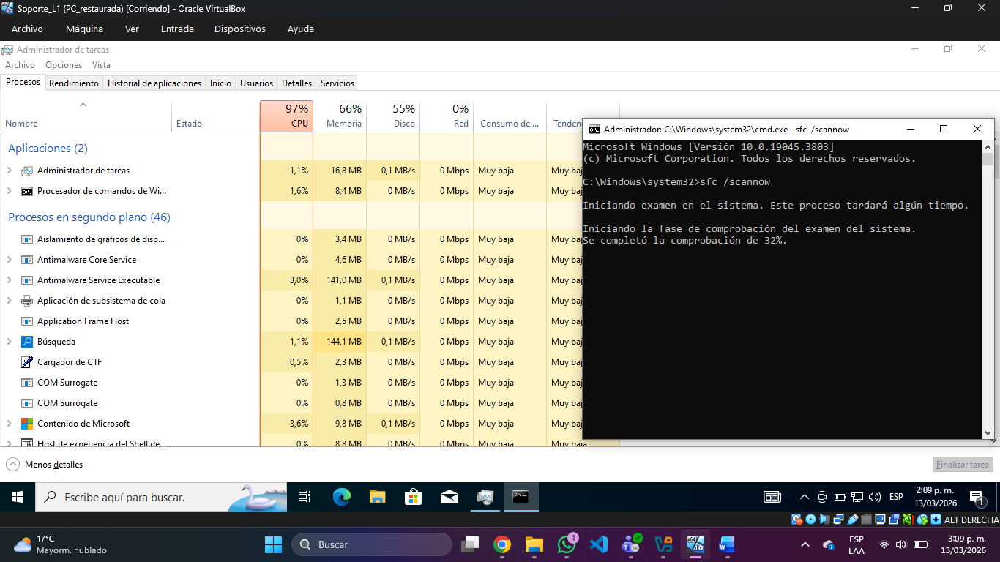
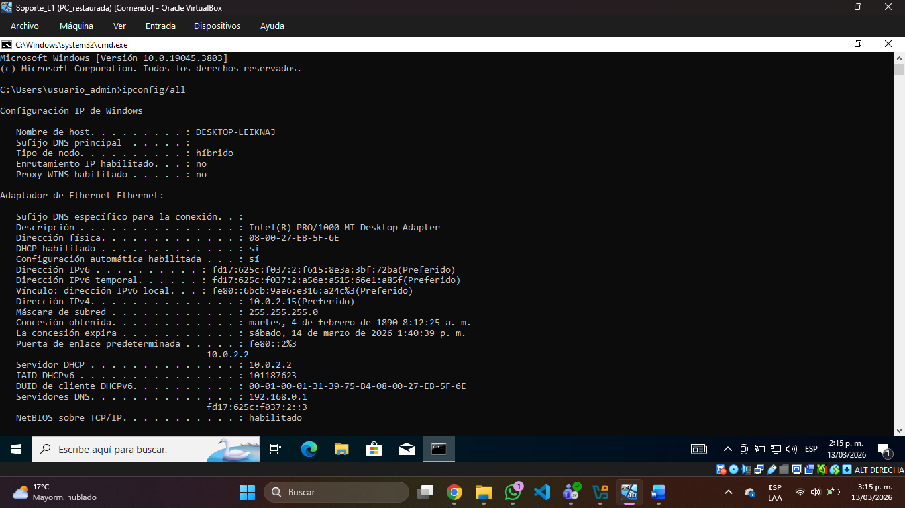
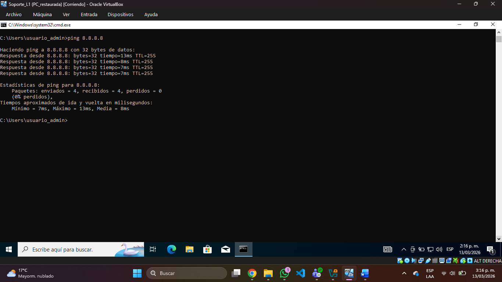
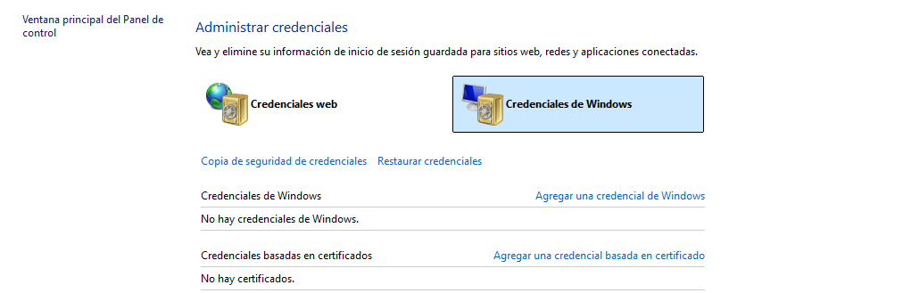
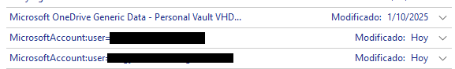
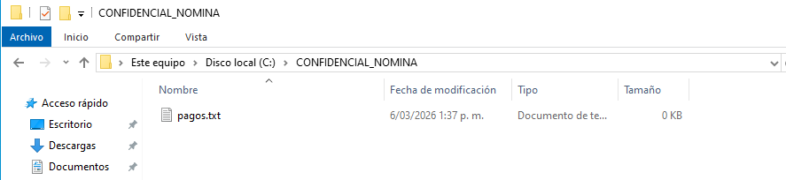
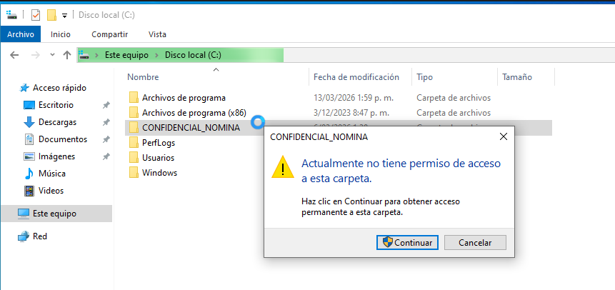
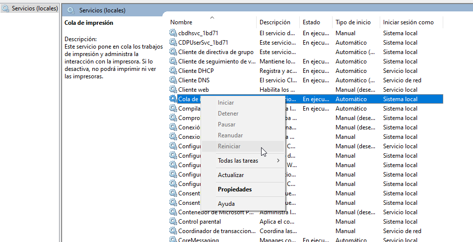
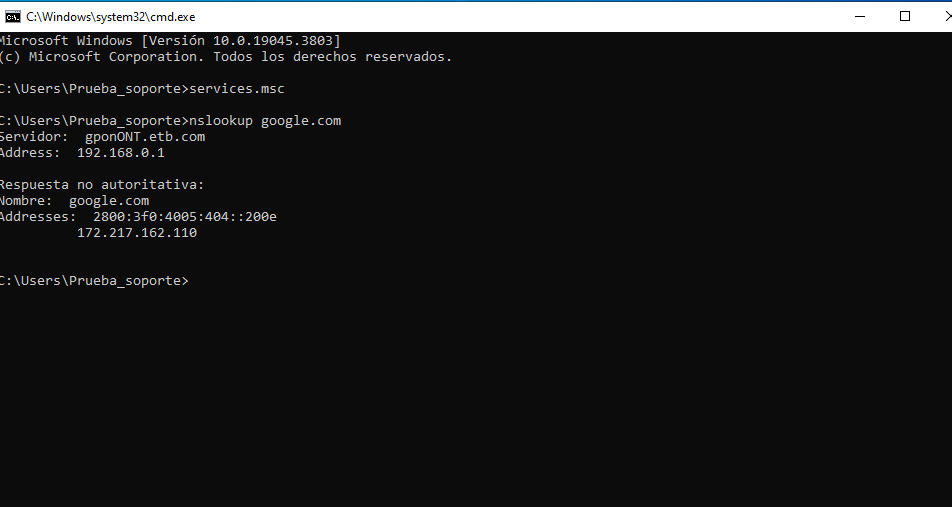

#Manual-Soporte-TI
Sergy Giovany Ferreira Meneses

#CASO 1: PC Lenta (Diagnóstico de Hardware y Software)

Problema: El sistema operativo tarda en responder o las aplicaciones se bloquean.
Diagnóstico: Revisión de procesos en tiempo real.
Acción: Abrir el Administrador de Tareas para identificar cuellos de botella en CPU, RAM o Disco.

Solución: Deshabilitar aplicaciones de inicio innecesarias en la pestaña "Aplicaciones de arranque" y ejecutar sfc /scannow en el CMD como administrador para reparar archivos del sistema.

#CASO 2: Sin Internet (Diagnóstico de Red)
Problema: El usuario no puede navegar en internet ni acceder a servicios locales.
Diagnóstico: Verificación de la configuración de red y conectividad con el Gateway.
Acción: Uso de comandos de consola para rastrear el fallo.

Solución: Si no hay IP, ejecutar ipconfig /release y luego ipconfig /renew. Si el DNS falla, cambiar a los DNS de Google (8.8.8.8).

#CASO 3: Outlook / Microsoft 365 (Bucle de Contraseña)
Problema: Outlook solicita la contraseña repetidamente a pesar de que el usuario ingresa la correcta.
Diagnóstico: Credenciales obsoletas guardadas en el caché de Windows.
Acción: Limpieza del Administrador de Credenciales.

Solución: Eliminar las credenciales ligadas a Office y reiniciar Outlook para forzar un nuevo inicio de sesión limpio.

 
#CASO 4: Gestión de Permisos de Archivos (Seguridad NTFS)
Problema: Un usuario reporta que no puede acceder a una carpeta compartida o, por el contrario, se requiere restringir el acceso a información sensible (nómina, datos legales) a usuarios no autorizados.
Diagnóstico: Revisión de las Listas de Control de Acceso (ACL) en las propiedades de seguridad de la carpeta.
Acción Realizada: Se configuraron permisos específicos para denegar el acceso al grupo o usuario no autorizado, manteniendo el acceso total para el Administrador.

Como se observa en la captura, el perfil de Administrador mantiene la visibilidad, pero al aplicar la política de 'Denegar' sobre el usuario final, Windows bloquea cualquier intento de lectura o escritura, protegiendo el recurso contra fugas de información

Configuración de permisos denegados para un usuario de prueba, garantizando la confidencialidad de la información.

#Caso 5: Soporte de Impresión
Acción: Reiniciar el servicio Print Spooler (Cola de impresión) desde services.msc.
Utilidad: Desbloquea la cola de documentos sin necesidad de reiniciar el equipo o reinstalar controladores.

 

#Caso 6: Diagnóstico de Conectividad (DNS)
Comando: nslookup google.com
Utilidad: Verifica que el servidor DNS está respondiendo. Si el ping a una IP funciona, pero el nombre no carga, el problema es el DNS.

